# Overview

 The Video Consultation App enables users to log in as either a Patient or a Doctor. Depending on the selected role, the app offers distinct features and a unique color theme for a personalized experience. The application is built using React Native Expo with real-time communication powered by Agora and Socket.IO.


## Features

- **Real-Time Video Calls**: 
  - Utilizes Agora SDK for real-time video and audio communication.
  - Handles token expiration and invalid token scenarios gracefully.
  - Enables users to mute their microphones and disable camera.
  - Placeholders for when a user's camera is disabled.
  - End call buton ends the call for both users.
- **Real-Time Messaging**: 
  - Uses Socket.IO for real-time communication between clients.
  - Different color themes for text boxes to distinguish between user messages and remote messages.
- **Cross-Platform Support**: 
  - Works seamlessly on Android and iOS devices.
- **Notifications**:
  - Notification for when a doctor initiates a call with the patient in the form of dynamic buttons that appear in the Patient Dashboard with the          option to accept or reject the call.

---

## Tech Stack

### Frontend
- **React Native** (with Expo)
- **Agora SDK** (for video calls)
- **Socket.IO Client**

### Backend
- **Node.js** (server-side runtime)
- **Express.js** (framework for the REST API)
- **Socket.IO** (real-time communication)

### Backend Hosted on *Koyeb*
---

## Prerequisites

1. Install **Node.js**.
2. Install **Expo CLI**.
3. Set up an **Agora.io** account to get your App ID and Token generation credentials.
4. Install **Java JDK** and Android Studio for Android development.

---
## Clone the Repository
```bash
git clone https://github.com/Farmaan-Malik/essenZvita_Assignment
```
## Setup Instructions
Install Dependencies and prebuild
```bash
npm install
```
```bash
npx expo prebuild
```
## Configure Agora SDK
- Sign up at Agora.io and create a project.
- Replace "appId" in the source code with your Agora App ID for both (main)/patientScreen and (main)/index.
- Generate a temporary token in Agora console and replace the "token" constant's value with your temporary token.

## Run the Application
### Run on Android
```bash
npx expo run:android
```
### Run on IOS
```bash
npx expo run:ios
```
## Challenges Faced
### Integrating Agora for Real-Time Video Communication
Integrating Agora for real-time video and audio calls posed a significant challenge due to the complexity of the SDK and the configuration required for a seamless experience. Ensuring smooth communication between the front end and Agora's backend, along with proper management of video and audio streams, was crucial to avoid connectivity issues.

### Handling Real-Time Notifications with Socket.IO
Implementing real-time notifications using Socket.IO required setting up a reliable communication channel between the front end (React Native) and the backend (Node.js). One of the main challenges was ensuring that notifications were delivered in real-time to both doctors and patients without any delays. Handling scenarios like multiple clients connected at once, ensuring that messages were sent to the correct user, and managing socket disconnections were key concerns that had to be addressed.

### Managing Different User Roles (Doctor and Patient)
The app needed to support two different user roles with distinct color themes, layouts, and functionalities. The challenge was in handling dynamic theme changes when the user switched between being a Doctor and a Patient. Ensuring that each user’s experience was customized while maintaining the app's integrity across both roles required proper state management and conditional rendering. Moreover, the user interface had to adapt smoothly to both roles without breaking the overall user experience.

### Synchronizing Backend and Frontend
Ensuring seamless communication between the Node.js backend and the React Native front-end posed challenges, especially during video call sessions. Synchronizing socket events between multiple clients (doctors and patients) and efficiently broadcasting events, required a solid understanding of both front-end and back-end technologies.

### Debugging Complex Real-Time Features
Testing and debugging real-time communication features like video calls and notifications in development mode was particularly challenging. Issues like poor network connectivity, device incompatibility, and delayed notification delivery had to be addressed. Utilizing Expo’s debugging tools and Agora’s logging features helped identify issues quickly, but frequent testing on multiple devices was crucial to ensuring consistent performance.

### Testing on Real Devices
The app had to be tested on real devices rather than emulators due to the complexity of features like real-time video calls, notifications, and device-specific functionalities. Some features, particularly Agora’s video calls, did not work properly on ios emulator and required actual hardware for testing. Ensuring that the app was fully functional on various devices with different specifications and operating systems was an essential part of the development process to avoid potential issues in production.

### Notification Setup
The app was going to use agora notification but the documentation for it had been removed, hence the  transition to a Nodejs backend. Android emulators were not properly communicating with the locally hosted backend. Hosted the server on Keyob and user socket.io to dynamically show elements at the frontend.


# Note:
As mentioned above, the app should be tested on real devices for the video call feature.

### Login Screen
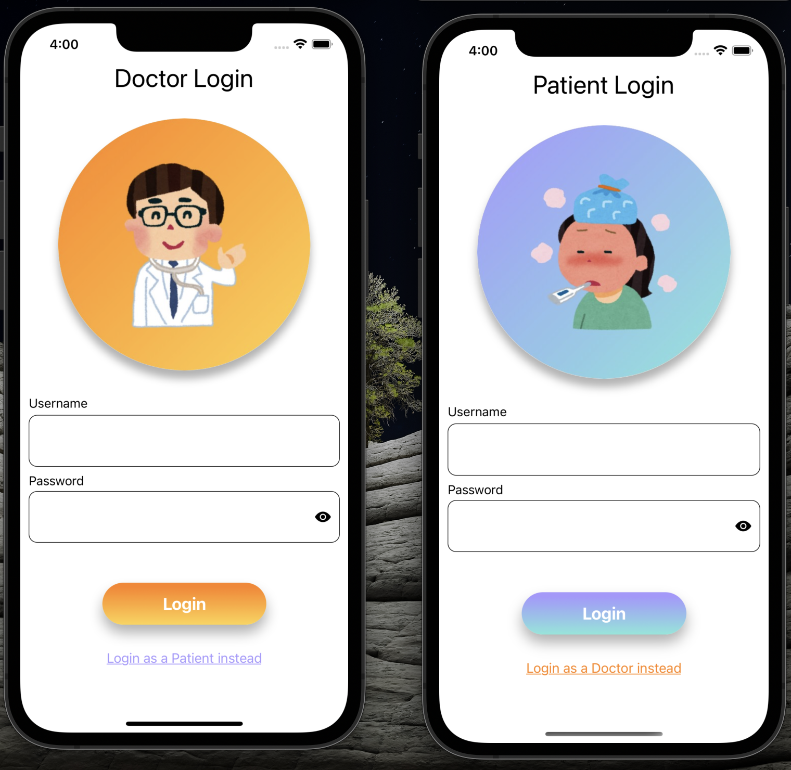

With seperate themes for Doctor and patient, this page acts as a gateway into the app. I have created the assets used in this app using Canva.

### Login Setup with Hardcoded credentials 
 <Div>
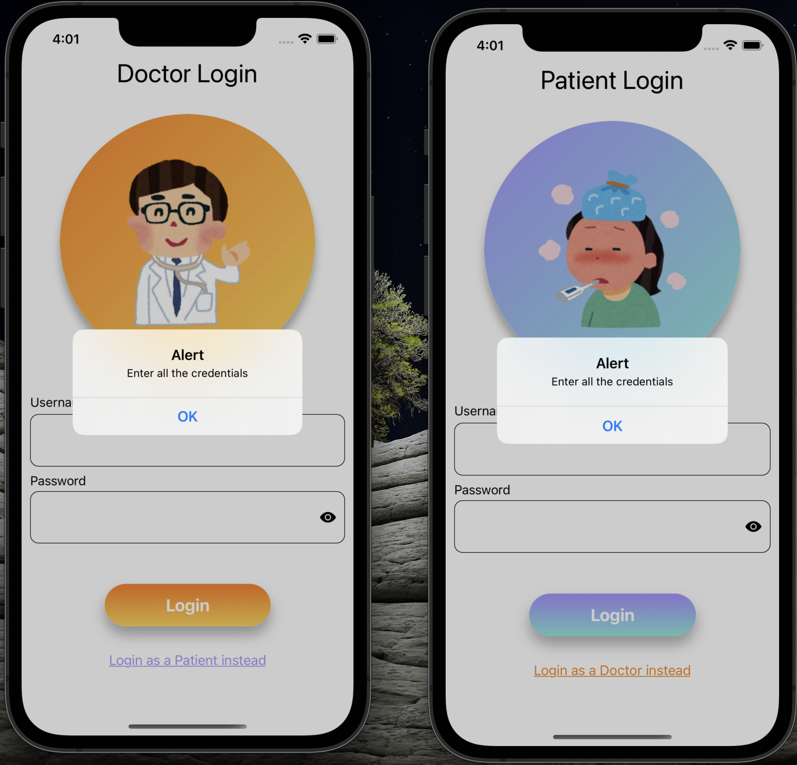
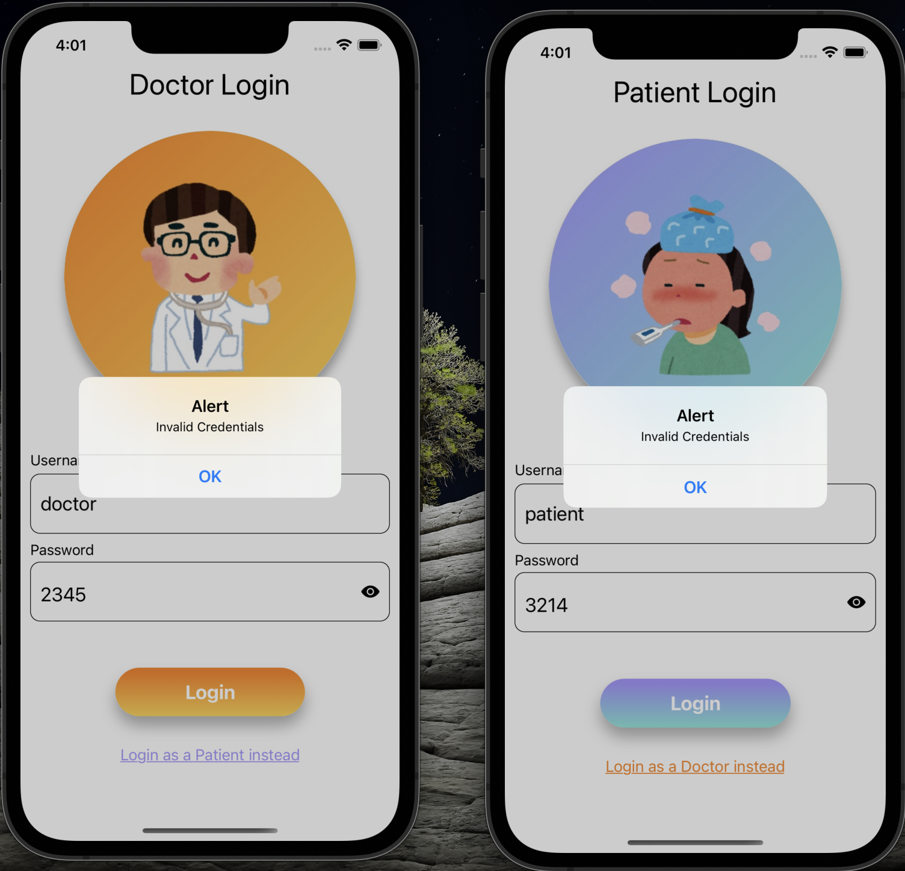
 </Div>

 Credentials are hardcoded into the app:
 #### Doctor credentials: 
 - username: doctor
 - password: 1234

  #### Patient credentials: 
 - username: patient
 - password: 5678
 
### Doctor and Patient Dashboards
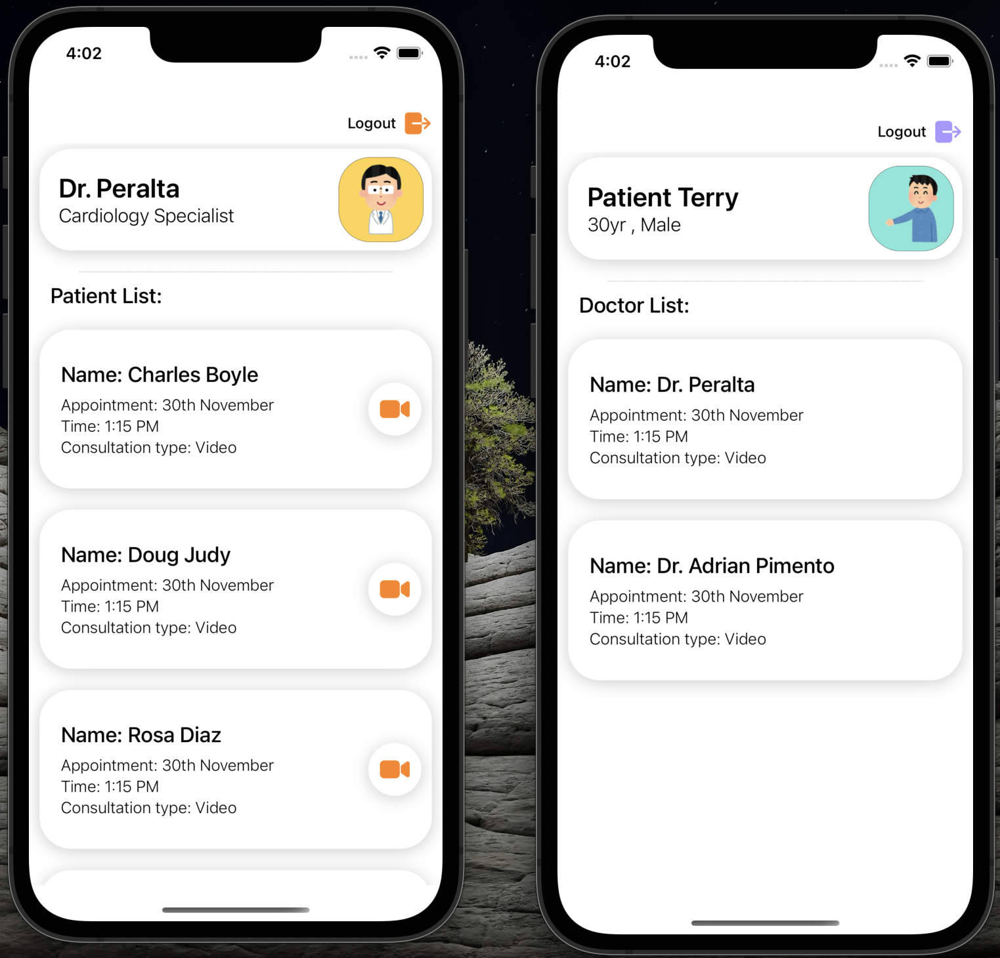

#### Doctor dashboard shows a list of patients with some dummy values. The doctor can initiate a video call with patients by pressing the video cam icon on the patient card. Once initiated, the patient is sent a notification which triggers the appearance of the doctor cards revealing "Accept" and "Reject" buttons.

### Call Alert using Dynamic buttons
<Div>
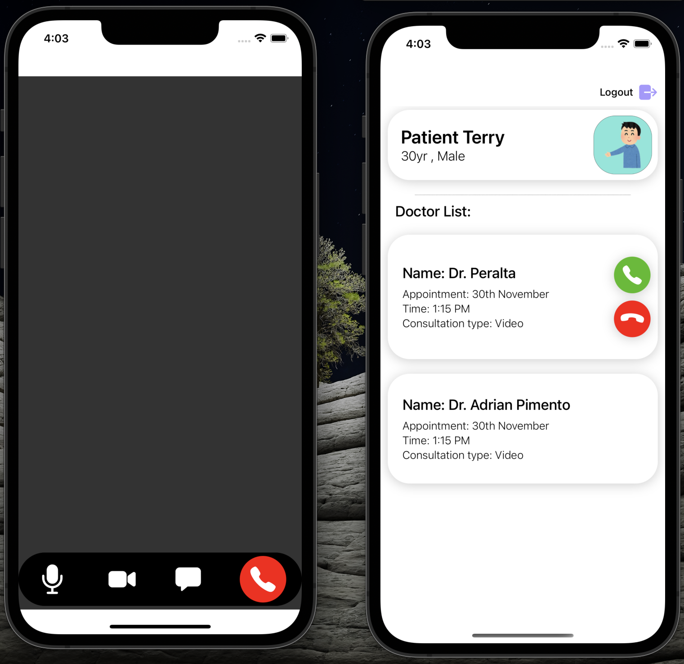
</Div>

### Video Call 
<Div>
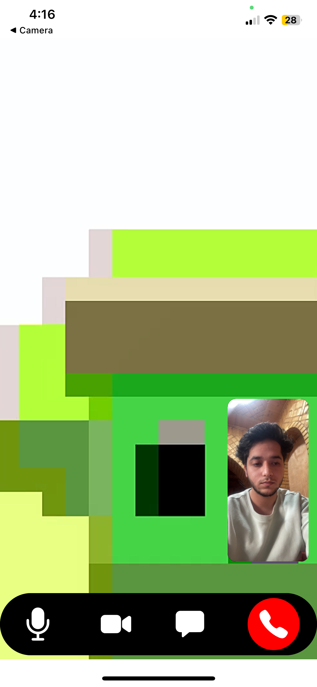
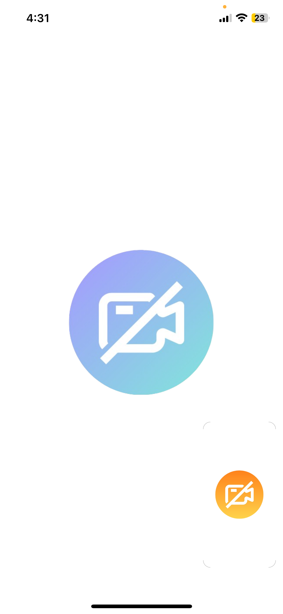
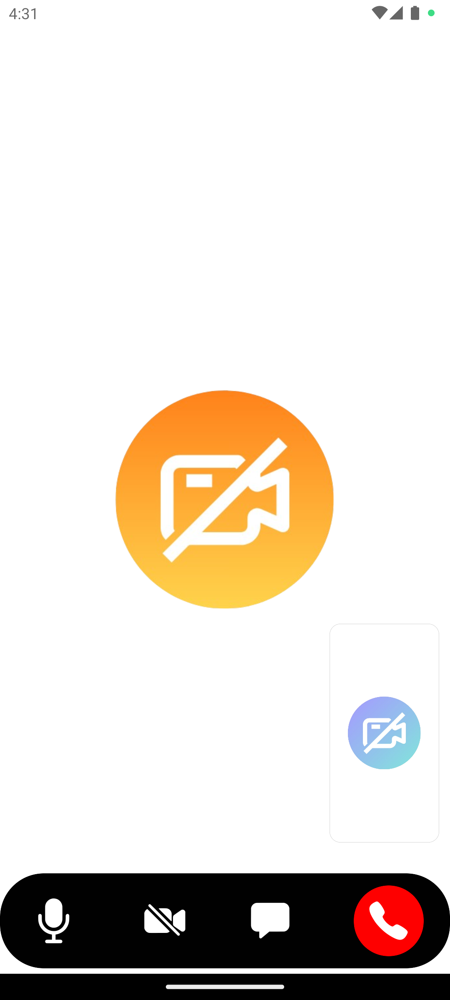
</Div>

A Remote view that displays the other user's video feed and a small Local View that displays your own video feed.
- Added placeholders that go with the overall theme of the users ui.

#### Patient can either accept or reject the call. If rejected, the buttons disappear. At the same time, the doctor (currently in the video call screen) is taken back to the Doctor dashboard.

### Chat within a video call
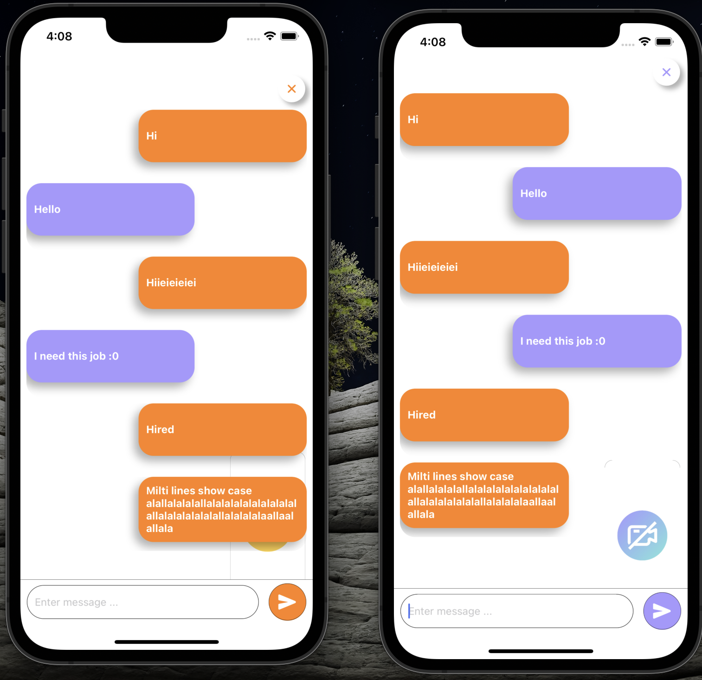

#### The bottom control panel can be toggled by tapping on the screen. This panel consists of 4 buttons:
- Mute: Enables the user to mute his/her mic.
- Camera: Allows user to turn their camera off or on.
- Chat: Opens the chat screen enabling users to chat with eachother.
- End call: When pressed, this button ends the call for both the users.

  ##### The chat screen displays message boxes with different colors and the close chat button and send button follow the current ui theme.

### Token Error Handling
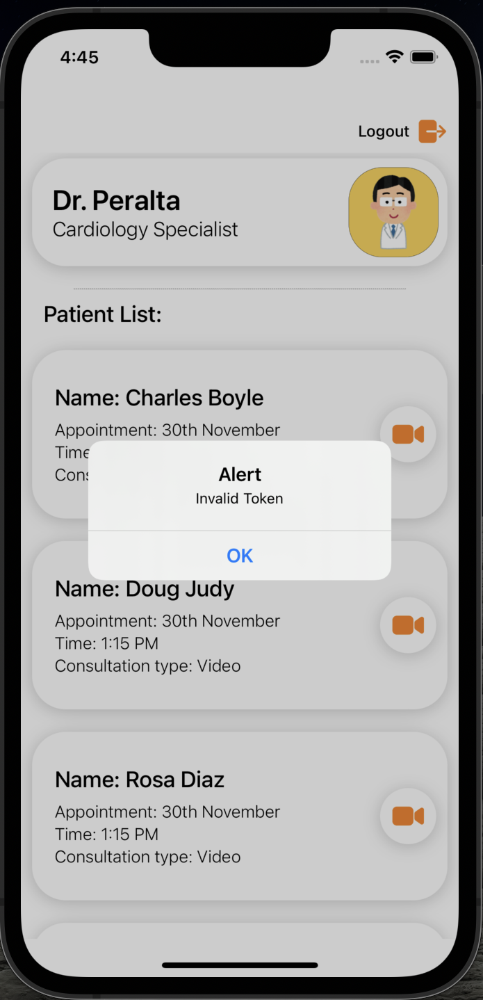

#### Error handling logic that shows an alert when a token has *expired* , or is *invalid*.
- It also shows an alert with a generic "Error occured" message if an unknown error occurs.


### Network handling

   <Div>
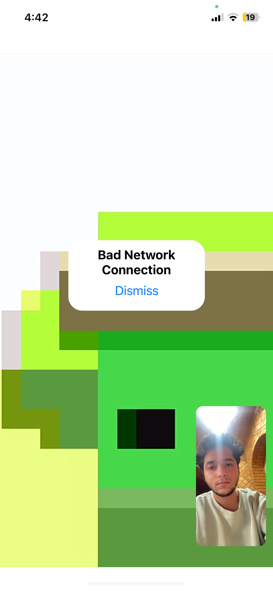
   </Div>

   Displays an alert when the network quality of either of the users is bad.


